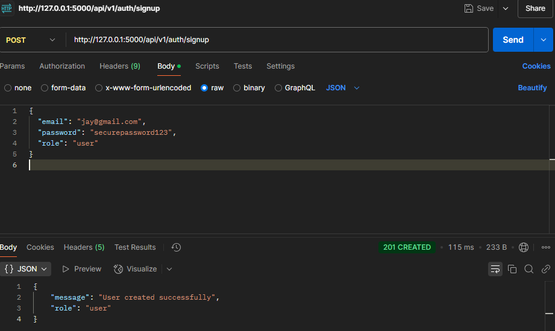
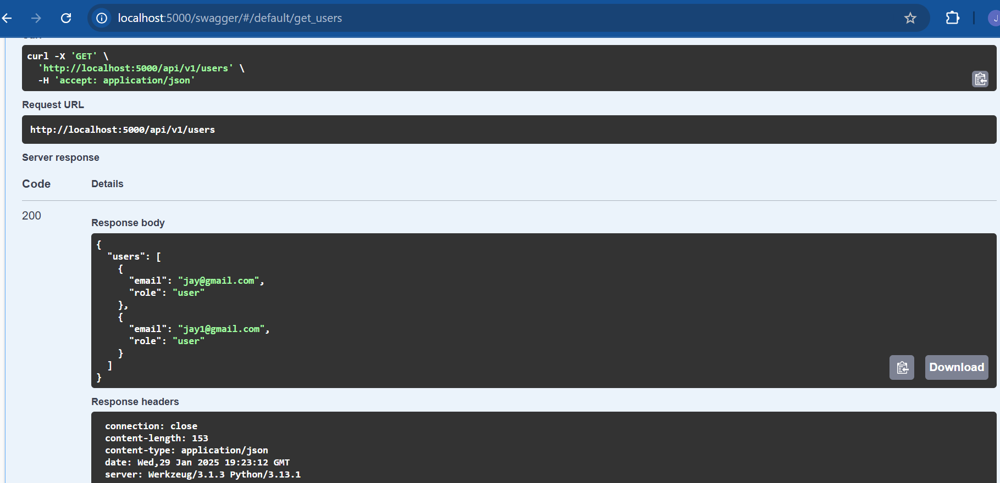
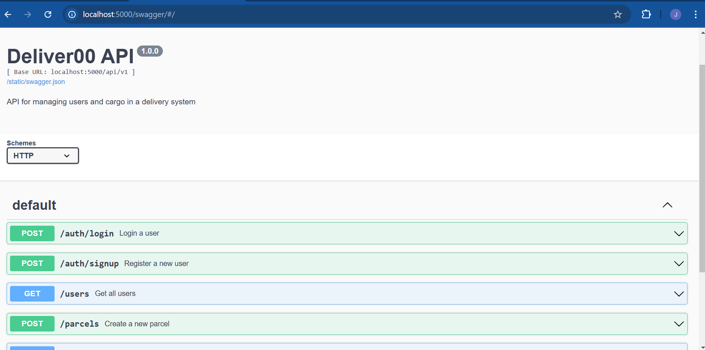

# Backend APIs Project Overview

This project includes a signup and login feature. Below are previews of the `signup` and `login` screens.

## Signup Screen

The signup screen allows users to create an account by providing their credentials.

## Login Screen

The login screen enables users to log in using their credentials.

---
install swagger: pip install flask-swagger-ui
## Swagger

## Ltesting on swagger

